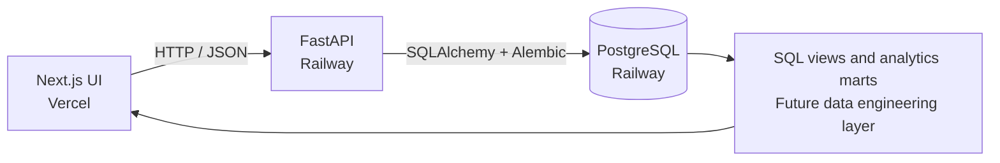
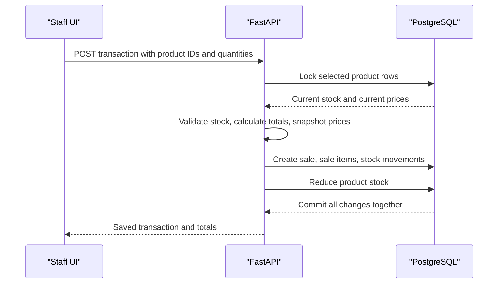
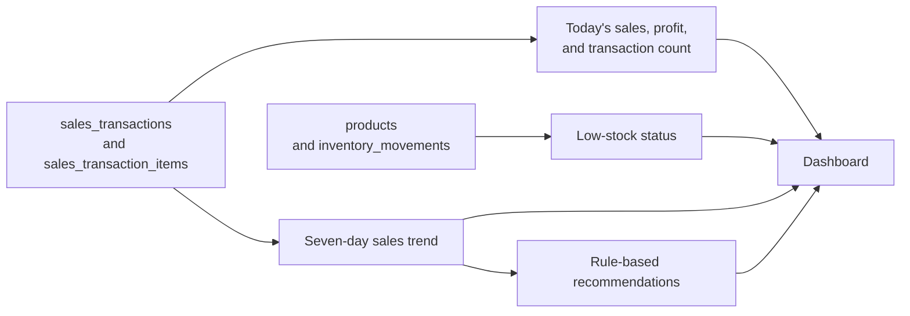
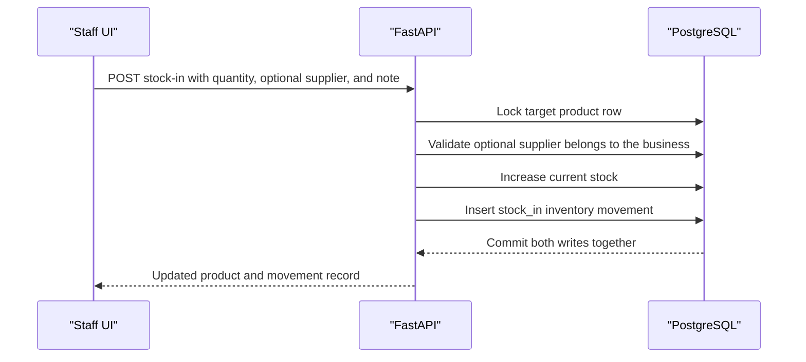
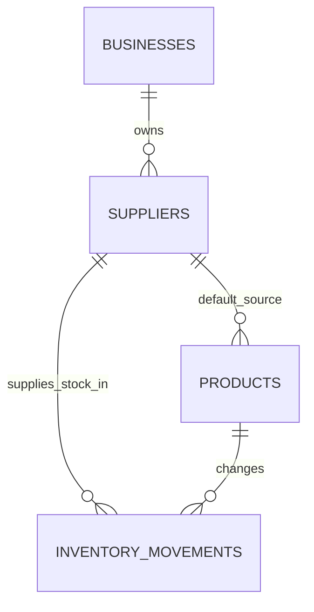
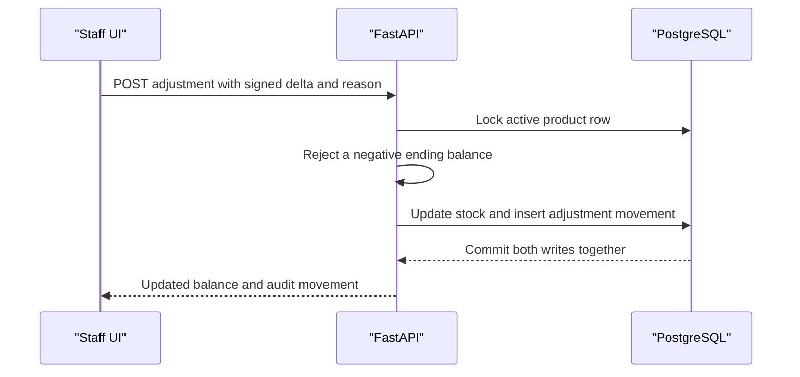
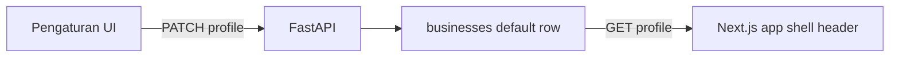
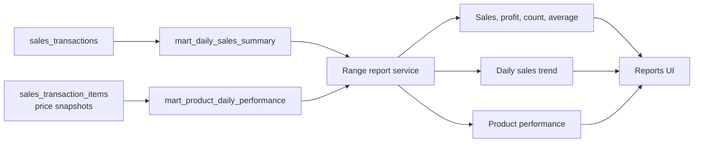

# System Architecture

## Diagram

## Frontend Responsibilities

- App shell and navigation.
- Indonesian UI labels.
- Dashboard, transaction, product, insight, report, supplier, and settings pages.
- Fetch data from FastAPI using `NEXT_PUBLIC_API_BASE_URL`.
- Show graceful empty/error/loading states.

## Backend Responsibilities

- API contract and validation.
- Health check.
- Products, transactions, inventory, analytics, and insights route structure.
- Current: product persistence, transaction creation, stock locks, inventory history, and SQL-backed dashboard aggregation.
- Later: auth, role checks, and richer business rules.

## Database Responsibilities

- Current: store the default business, products, sales transactions, transaction items, and inventory movements through Alembic-managed tables; derive dashboard aggregates directly from them.
- Later: analytics views/marts for daily sales summary, product performance, low stock alerts, and restock recommendations.

## Deployment Direction

- Frontend: Vercel.
- Backend: Railway FastAPI service.
- Database: Railway PostgreSQL.

## Future Analytics/Data Engineering

- SQL views or marts for KPI dashboards.
- Scheduled ETL/ELT jobs after transactional tables stabilize.
- Supplier performance analysis.
- Rule-based restock recommendations before forecasting.

## Sales Transaction Flow

## Dashboard Data Flow

## Stock-In Data Flow

## Supplier Relationship

## Stock Adjustment Flow

## Business Profile Flow

## Reports Data Flow

## Technical Risks

- Railway cold starts or low-tier resource constraints.
- Incorrect Vercel backend URL.
- CORS misconfiguration.
- Secrets accidentally exposed to frontend.
- Schema changes after user validation.
- Messy real UMKM data.
- Auth is required before real sensitive profit data is used by staff.
