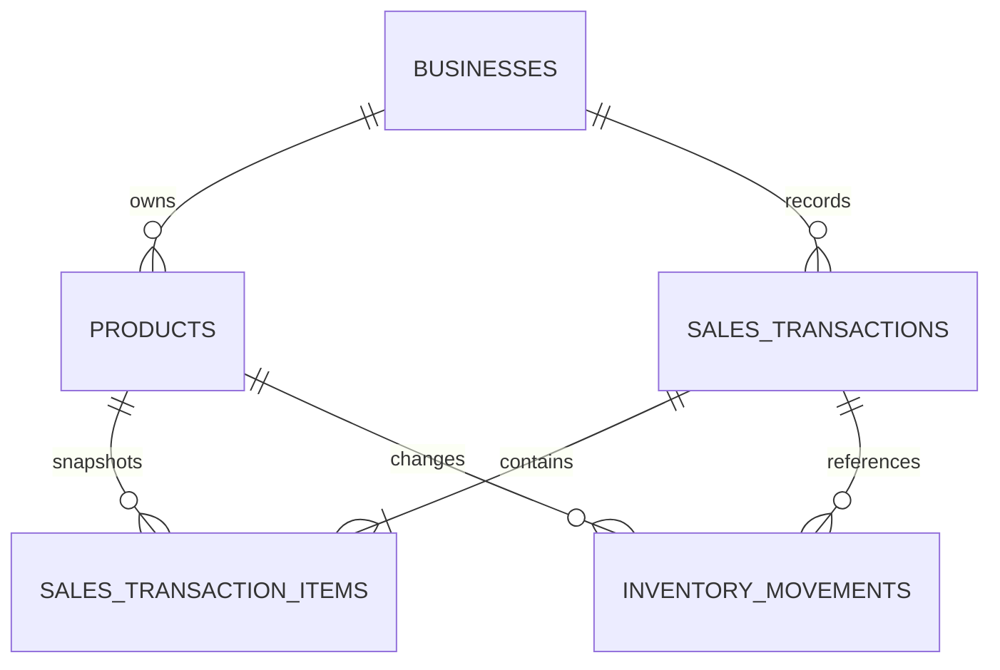

# API and Data Contract

## Current Endpoints

- `GET /health`
- `GET /api/v1/analytics/summary`
- `GET /api/v1/products`
- `POST /api/v1/products`
- `GET /api/v1/transactions`
- `POST /api/v1/transactions`
- `GET /api/v1/inventory/movements`
- `POST /api/v1/inventory/products/{product_id}/stock-in`
- `GET /api/v1/reports/overview?days=1..365`
- `GET /api/v1/suppliers`
- `POST /api/v1/suppliers`
- `PATCH /api/v1/products/{product_id}`
- `DELETE /api/v1/products/{product_id}`
- `POST /api/v1/inventory/products/{product_id}/adjustment`
- `GET /api/v1/business/profile`
- `PATCH /api/v1/business/profile`

`GET /api/v1/analytics/summary` is database-backed. It derives today's sales, gross profit, transaction count, seven-day sales trend, low-stock products, top products, recent transactions, and rule-based recommendations from operational tables.

Product creation request:

```json
{
  "name": "Beras Ramos 5kg",
  "category": "Sembako",
  "unit": "karung",
  "purchase_price": 58000,
  "selling_price": 68000,
  "current_stock": 8,
  "minimum_stock": 10
}
```

`POST /products` returns `201`; duplicate active names return `409`; invalid values return `422`.

Transaction creation request:

```json
{
  "payment_method": "QRIS",
  "notes": "Pesanan pelanggan tetap",
  "items": [
    { "product_id": "uuid-product-1", "quantity": 2, "discount": 1000 },
    { "product_id": "uuid-product-2", "quantity": 1, "discount": 0 }
  ]
}
```

The server reads current product prices, snapshots selling and purchase prices, then returns totals and sale items. `POST /transactions` returns `201`; insufficient stock returns `409`; missing products return `404`.

Stock-in request:

```json
{
  "quantity": 24,
  "supplier_id": "uuid-supplier-1",
  "notes": "Restock dari pemasok"
}
```

`POST /inventory/products/{product_id}/stock-in` locks the product row, increases `current_stock`, and creates an `inventory_movements` row with `movement_type: "stock_in"` in the same transaction. `supplier_id` is optional but must be an active supplier in the current business. It returns `201`; missing products or suppliers return `404`; quantities must be whole numbers from 1 through 10,000.

Inventory movement response fields include `product_id`, `product_name`, `product_unit`, optional `supplier_name`, `movement_type`, `quantity_delta`, `stock_after`, `notes`, and `created_at`.

Supplier creation request:

```json
{
  "name": "CV Sumber Makmur",
  "contact": "0812-3456-7890",
  "product_category": "Makanan",
  "average_delivery_days": 2
}
```

Supplier contact, category, and delivery days are optional. `POST /suppliers` returns `201`; duplicate active supplier names return `409`.

Product update accepts name, category, unit, purchase and selling price, and minimum stock. Stock is intentionally excluded; `DELETE /products/{product_id}` soft-deactivates the product so historical sales remain intact.

Stock adjustment request:

```json
{
  "quantity_delta": -2,
  "notes": "Barang rusak saat audit stok"
}
```

`quantity_delta` must be a non-zero whole number from -10,000 to 10,000 and `notes` is required. The endpoint returns `201`; an adjustment that would make stock negative returns `409` without writing a movement.

Business profile update request:

```json
{
  "name": "Toko Rina Jaya",
  "business_category": "Toko Kelontong"
}
```

The current MVP updates only the default business profile; `currency_code` remains `IDR`. Multi-business management is deferred until authentication and tenancy requirements are defined.

Report overview response includes the requested `period_start`/`period_end`, sales and gross-profit KPIs, transaction and unit counts, one daily point per requested day, and product-performance rows. On PostgreSQL, the endpoint reads `mart_daily_sales_summary` and `mart_product_daily_performance`; SQLite tests use the equivalent operational aggregation. Product sales and profit use `sales_transaction_items` snapshots so later product price edits do not rewrite history.

## Planned Endpoints

- `GET /api/v1/insights/recommendations`
- Future auth endpoints for login/session management.

## Current Sample Shapes

Analytics summary:

```json
{
  "total_sales_today": 2450000,
  "gross_profit_today": 620000,
  "transaction_count_today": 38,
  "low_stock_count": 7,
  "top_products": [],
  "recommendations": []
}
```

Product:

```json
{
  "id": "prd-beras-5kg",
  "name": "Beras Ramos 5kg",
  "category": "Sembako",
  "unit": "karung",
  "purchase_price": 58000,
  "selling_price": 68000,
  "current_stock": 8,
  "minimum_stock": 10,
  "status": "Menipis"
}
```

Transaction:

```json
{
  "id": "trx-001",
  "date": "2026-09-13T10:30:00Z",
  "payment_method": "QRIS",
  "subtotal": 136000,
  "total_discount": 1000,
  "total_amount": 135000,
  "gross_profit": 19000,
  "total_quantity": 2,
  "notes": "Pesanan pelanggan tetap",
  "items": [
    {
      "product_name": "Beras Ramos 5kg",
      "quantity": 2,
      "selling_price": 68000,
      "purchase_price": 58000,
      "discount": 1000,
      "line_total": 135000
    }
  ]
}
```

## Transaction Data Model



## Data Model Direction

Operational tables:

- `businesses`
- `users`
- `suppliers`
- `products`
- `sales_transactions`
- `sales_transaction_items`
- `inventory_movements`
- `purchase_orders`, future

Analytics tables/views:

- `dim_product`
- `dim_supplier`
- `dim_date`
- `fact_sales`
- `fact_inventory`
- `mart_daily_sales_summary`
- `mart_product_performance`
- `mart_low_stock_alerts`
- `mart_restock_recommendations`

## Validation Rules

- Product stock cannot be negative unless admin override is added later.
- Purchase and selling prices must be greater than or equal to 0.
- Low stock when `current_stock <= minimum_stock`.
- Out of stock when `current_stock <= 0`.
- Gross profit is `(selling_price - purchase_price) * quantity`.
- Transaction-level discounts reduce gross profit and may make it negative; losses are valid business data.
- Margin calculations must handle division by zero.

## Error Response Direction

Use standard FastAPI HTTP errors initially:

```json
{ "detail": "Readable Indonesian or technical-safe error message" }
```

Future APIs should use consistent error codes for frontend display.
