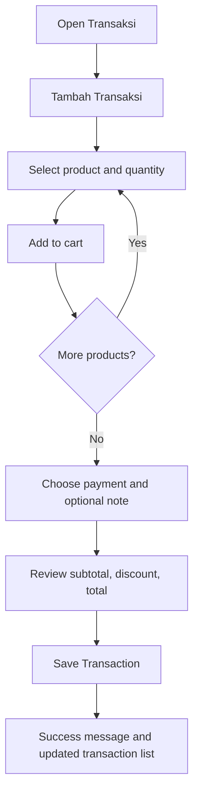
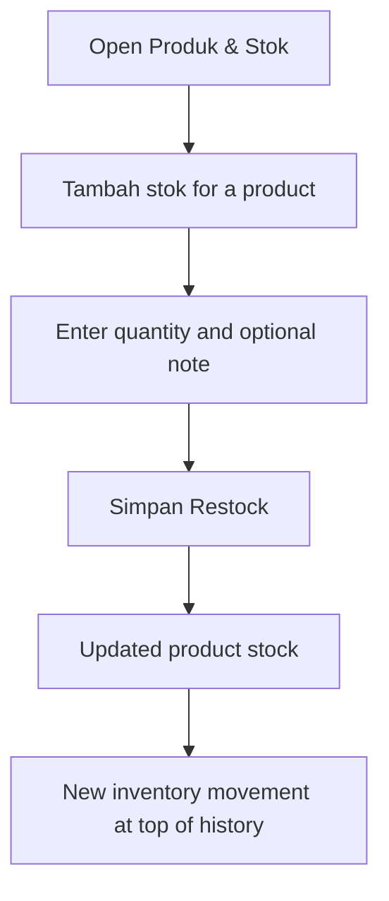
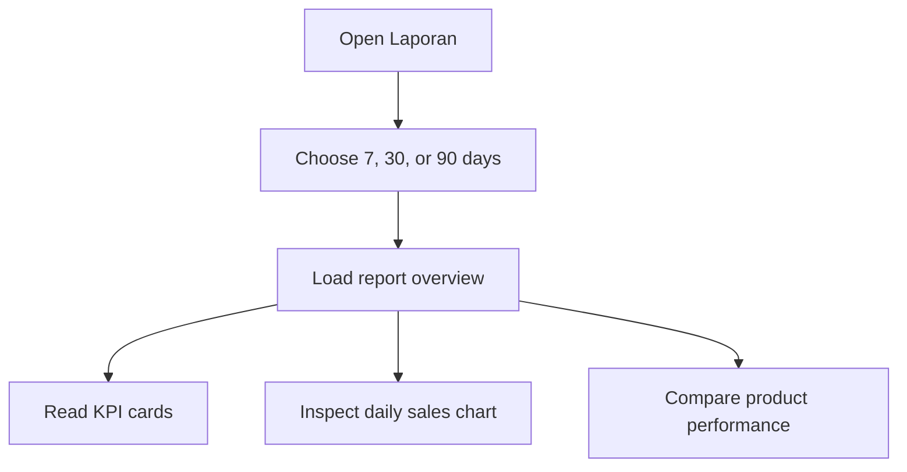
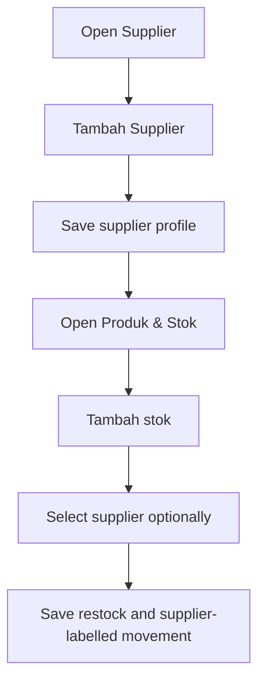
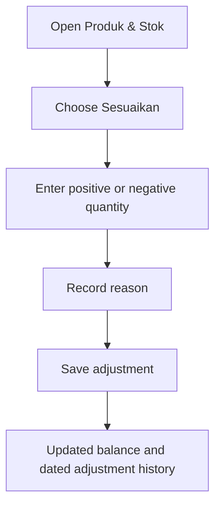
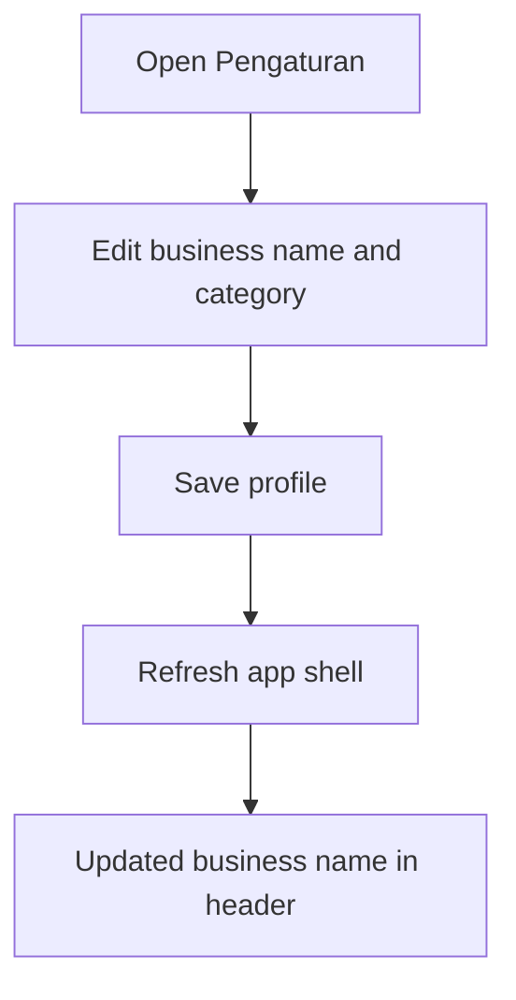

# UI Routes and Components

## Routes

- `/`: Dashboard.
- `/transactions`: Transaksi.
- `/products`: Produk & Stok.
- `/supplier`: Supplier list and creation.
- `/insight`: Live recommendations and action-focused product lists.
- `/reports`: Range sales report and product performance.
- `/settings`: Persistent business profile settings.

## Main Components

- App shell with desktop sidebar and mobile bottom navigation.
- KPI cards.
- Live dashboard KPI cards, seven-day sales trend, and rule-based operational recommendations.
- Section cards.
- Status badges for `Aman`, `Menipis`, and `Habis`.
- Add Product modal with native and backend validation.
- Add Transaction modal with product selection, cart, per-item quantity/discount, payment method, and calculated total.
- Responsive product table on desktop and complete product rows on mobile.
- Stock-in modal and inventory movement history on Produk & Stok.
- Reports view with 7/30/90-day range control, KPI cards, daily sales chart, and product-performance table.
- Supplier list and creation modal; stock-in optionally selects a saved supplier.
- Product metadata edit, confirmed soft deactivation, and stock adjustment modal with mandatory reason.
- Business profile settings form that refreshes the app shell header; data-backed Insight screen.
- Empty state.
- Error state.
- Recommendation cards.

## Design Rules

- Indonesian labels in user-facing UI.
- Light theme.
- Green/teal primary color direction.
- Orange/amber for warning and recommendations.
- Red only for critical status.
- Simple, practical, non-enterprise dashboard feel.
- Avoid technical jargon.

## Responsive Behavior

- Desktop uses a left sidebar.
- Mobile stacks cards vertically and uses bottom navigation.
- Main actions stay visible and readable on small screens.

## Transaction UI Flow

## Stock-In UI Flow

## Reports UI Flow

## Supplier-to-Stock UI Flow

## Stock Adjustment UI Flow

## Business Profile UI Flow

## Label Guidance

- Use `Total Penjualan`, not `Revenue`.
- Use `Keuntungan Kotor`, not `Gross Profit`.
- Use `Stok Menipis`, not `Low Stock`.
- Use `Produk Terlaris`, not `Top Products`.
- Use `Saran Restock`, not `Restock Recommendation`.

## Logo/Branding Notes

- The app shell uses the provided logo from `/brand/larisin-icon.png`.
- Expected path: `frontend/public/brand/larisin-icon.png`.
